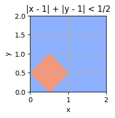

- 现代 GPU 实现了一种名为**光栅化流水线**（Rasterization Pipeline）的抽象概念。这一抽象将**三维三角形转换为二维像素**的过程分成几个高度并行的阶段，从而实现了各种高效的硬件实现。在本作业中，您将在软件中实现简化光栅化流水线的部分功能。虽然经过简化，但您的管道将足以让 Scotty3D 在没有 GPU 的情况下创建预览渲染！

- 不同的图形应用程序接口可能会以不同的方式呈现这一流水线，但其核心步骤是一致的：
  - GPU 通过在顶点列表上运行代码（并行）来绘制图形，以产生均匀的屏幕位置（+ 额外的变化数据），
  - 从顶点列表中构建三角形，
  - 剪切clipping三角形以移除屏幕上不可见的部分，
  - 执行分割division以计算屏幕位置，
  - 计算这些三角形覆盖的片元 "fragments" 列表，
  - 在每个片元上运行代码，并将结果合成到帧缓冲区framebuffer中。
- **重要**：在开始之前，请阅读 src/rasterizer/pipeline.h，以了解我们的代码是如何实现这一流水线的。熟悉本作业中经常提到的术语，如像素、片元、属性和样本。您将在 src/rasterizer/pipeline.cpp（以及其他几个文件）中填写函数，以完成此实现。

## A1T1 Scene Functions

您的第一项任务是在 Scotty3D 中完成scene graph的实现，在 Transform 类（用于表示对象位置）中填写两个函数。

正如我们在三维变换讲座中所讨论的，Scotty3D 使用场景图来表示场景中物体的位置。

我们的场景图（src/scene/scene.h）使用 Transform 对象（src/scene/transform.h）来**表示对象空间和世界空间之间的转换**，这些对象记录了从对象本地位置移动到相对于每个对象的父对象的位置时必须应用的**缩放、旋转和平移**（按此顺序！）。

- 事实上，`Transform::local_to_parent` 可以方便地将这些变换返回为一个 4x4 矩阵 (Mat4)。

你的工作就是填写 Transform::local_to_world 和 Transform::world_to_local 这两个函数，它们返回的 Mat4 表示从对象空间到/从世界空间的变换。

### Anwser

- `local_to_world` 就是求从本地坐标变换到世界坐标的矩阵
- `world_to_local`就是反过来
- 要注意的点是矩阵是从右往左一次应用，区分开即可

```c++
Mat4 Transform::local_to_world() const {
	// A1T1: local_to_world
	//don't use Mat4::inverse() in your code.

	if (std::shared_ptr<Transform> parent_ = parent.lock()) {
		//此时该transform有parent
		return  parent_->local_to_world() * local_to_parent();
	} else {
		// 没有parent
		return local_to_parent();
	}
}

Mat4 Transform::world_to_local() const {
	// A1T1: world_to_local
	//don't use Mat4::inverse() in your code.
	
	if (std::shared_ptr<Transform> parent_ = parent.lock()) {
		//此时该transform有parent
		return  parent_to_local() * parent_->world_to_local();
	} else {
		// 没有parent
		return parent_to_local();
	}
}
```


## A1T2 Lines

这个Task是要实现`Pipeline::rasterize_line( ... )`函数

- 遵循OpenGL的`diamond-exit rule`：只有line exit这个菱形时才在这个像素点绘制
  - 

- 我们鼓励您从[Bresenham's Algorithm](https://www.cs.helsinki.fi/group/goa/mallinnus/lines/bresenh.html)的实现开始，然后，如果您愿意，可以继续实现提高质量或优化绘图性能的算法。请注意，布列瑟纳姆算法**并不完全符合菱形退出规则**--您需要明确检查端点。
- 这个视频讲的很好 [youtube](https://www.youtube.com/watch?v=y_SPO_b-WXk&list=PLqVt3VSe1-ZaRMWPc_XHvhEQ59F3Gq_4C&index=2&t=1087s&ab_channel=UofMIntroductiontoComputerGraphics-COMP3490)

- 最后没有实现diamond exit rule，感觉很复杂

## A1T3 Flat Triangles


比线框更进一步的方法是绘制带有平面阴影的三角形，即从第一个顶点复制三角形的所有属性。

在pipeline使用 "flat "插值（即每个fragment的属性相同）的情况下，填写 `rasterize_triangle` 函数。想想这对fragment的导数derivatives 意味着什么。

您的实现应使用比简单测试屏幕上所有样本更有效的算法。要获得满分，至少应将**覆盖率测试限制在三角形的屏幕空间边界框内的样本**。不过，我们鼓励探索更高效的实现方法，例如采用讲座中讨论的 "**early out** "优化方法。

需要注意的是，如果两个三角形共享一条边，且采样点位于该条边上，则其中一个三角形应为该采样点emit一个fragment。处理这种情况的一种方法是 Direct3D 中使用的 "左上角 "规则。

由于我们没有明确要求按顺时针或逆时针顺序给出顶点，因此您首先需要确定所给三角形的绕行顺序。由此，您将能够确定以下内容（我们只提供了顺时针的情况，但请考虑如何将其调整为逆时针的情况）：

- 顶边 (CW)：这是一条水平边，连续顶点之间的两个 y 坐标相同，并且大于第三个顶点的 y 坐标。
- 左边缘 (CW)：这是一条在连续顶点之间 "向上 "延伸的边（想想为什么！）。

### 实现

- 求最大最小xy坐标 -> 遍历像素 -> 判断点是否在三角形内 -> emit fragment（注意对z根据重心坐标插值）
- 知识点：
  - 判断点是否在三角形内只需求z分量
  - 求重心坐标时需要根据点坐标求三角形面积：向量的叉乘是平行四边形面积，除以2就是三角形面积
  - 向量叉乘根据行列式来算


